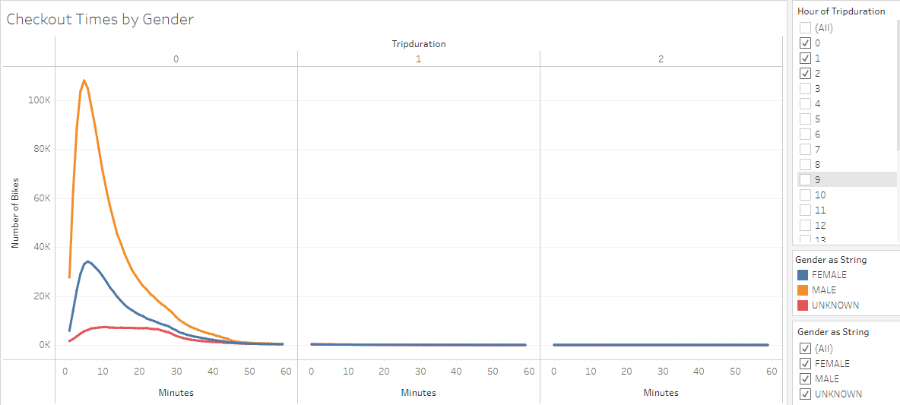
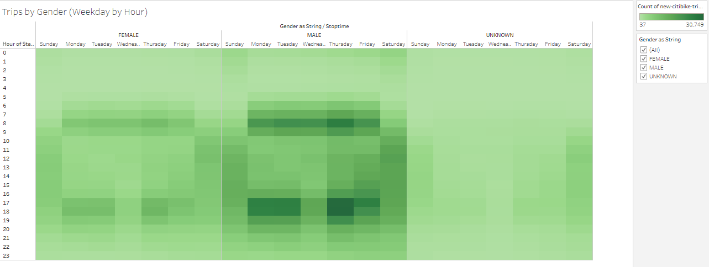

#  New York Citi Bike
## Overview

After a trip to New York City for two weeks, using CitiBike, you want to investigate creating a bikeshare business for your hometown of Des Moines, IA.  You will need to figure out how the NYC bikeshare works to be able to model it with adjustments.

## Purpose

We need to analyze the NYC data to base our proposal on.  Our research needs to include when, where, who, and how long to support a solid business proposal for a bikeshare model in Des Moines.

## Resources
Software(s): Tableau Public 2021.3, .csv files, Python 3.7, Pandas, and Visual Studio Code 1.57.1

## Link to Dashboards
Module Lesson:  https://public.tableau.com/views/Module14Lesson/NYCStory?:language=en-US&publish=yes&:display_count=n&:origin=viz_share_link

Module Challenge:  https://public.tableau.com/authoring/Module14Challenge_16320941566240/CitiBikeProposal#1

## Results

 

The approximate length of most trips is 20 minutes.  There is high demand for short trips which means there is a shorter turnover, reducing the number of bikes needed as they will be recycled quickly. 

 

Male users generally make three times the rides as female users. 

 

Generally during the weekday, it appears that many riders use the service for commuting, whether to work or school. 

 

Again, the number of males users is approximately 66% compared to female users at 34%. 

 

The majority of users are male subscribers using the service for commuting.  Short-term customers, possibly tourists, use the service more on the weekends.

### We need to know the number of bike trips and the proportion of short-term customers to annual subscribers to help us predict the volume and customer breakdown in Des Moines.

1. How many bike trips were recorded during the month of August? 
 

2. What is the proportion of short-term customers of the bike service to the annual subscribers? 
 

### We need to know the peak hours for bike trips so we can determine the number of bikes we may need as well as when we will need the most bikes available.  We need to know the peak usage hours so we can determine the best time for maintenance.

3. What are the peak hours for bike trips during the month of August? 
4. What are the peak usage hours for the month of August? 
 

### We need to know the top locations for starting and ending a bike journey to help estimate where to have the most bikes available as well as making a plan to transport bikes from the end points back to the starting points.

5. What are the top locations for starting a bike journey? 
 

6. What are the top locations for ending a bike journey? 
 

### We need the know the proportion of customers by gender to help predict the customer breakdown in Des Moines.

7. What is the proportion of customers by gender? 
 

### We need to know the average duration of a bike ride by age to set expectations for trip duration in Des Moines.

8. What is the average trip duration by age? 
 

### We need to know the number of bike trips and the trip duration per bike to estimate those used most often that will need more maintenance.

9. What is the number of rides per bike? 
 

10.  What is the average trip duration per bike? 
 

## Summary

There is a sound basis for a bikeshare business to support alternative commuter transportation as well as availability for weekend outings, potentially both for tourists and family outings.

Recommendations for further analysis includes:

* analysis by month to determine trends and peak seasons 
* weather data analysis to determine affects on riding
* research by gender and age to possibly promote riding groups/clubs

 
